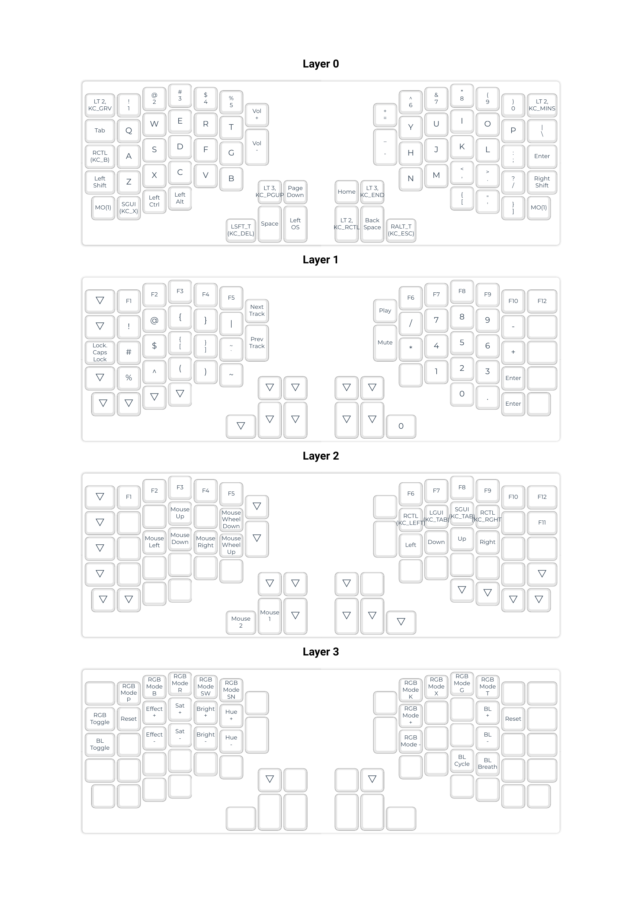

# My variant of [Redox](https://github.com/mattdibi/redox-keyboard) keymap

Welcome to the repository of my custom keymap for the Redox keyboard. 

## Table of Contents

- [Description](#description)
- [Redox Keyboard](#redox-keyboard)
- [Layers](#layers)
- [Flashing](#flashing)
- [Keymap Configuration](#keymap-configuration)


## Description

In this repository, I store and enhance my personal keymap variant for this open-source keyboard that I handwired myself. This keymap might not be perfect, but I'm exploring different configurations through trial and error to make keyboard usage as convenient as possible for my needs.

## Redox Keyboard

> The Redox is a keyboard project designed with ergonomics in mind. It uses Cherry MX style mechanical switches laid out in a 7x5 columnar stagger layout with components that can easily be sourced.
>
> The design was heavily inspired by the Ergodox keyboard, and its main goal is to reduce the size without sacrificing too many keys, hence the name Reduced Ergodox.

A quote from the [Redox](https://github.com/mattdibi/redox-keyboard) repository

## Layers

I configure the keys in a way that caters to my daily work and entertainment needs. This keymap variant may change as I experiment and gain experience.



## Flashing

_This method of flashing the keyboard is just convenient for me at the moment. The [method](https://docs.qmk.fm/#/newbs_building_firmware_workflow?id=building-qmk-with-github-userspace) recommended in the QMK manual is preferable._


 1. Install [QMK](https://docs.qmk.fm/#/newbs_getting_started)
 1. Clone keymap [repo](https://github.com/md5orsha256/redox-keymap/)
 1. Create symlink:
    ```shell
    ln -s <KEYMAP_PATH> <QMK_PATH>/keyboards/redox/keymaps/<KEYMAP_NAME>
    ```
    `<KEYMAP_PATH>` - path to the keymap that was cloned in the previous step

    `<QMK_PATH>` - the path to QMK. In unix-like systems it is usually `~/qmk_firmware`.

    `<KEYMAP_NAME>` - keymap name to be used in further commands
 1. Flash keyboard
    
    ___!IMPORTANT:___ _Both hands must be flashed_

    way 1. You can use qmk's make commands:
    ```shell
    make redox/rev1:<KEYMAP_NAME>:avrdude
    ```

    _\*This command must be run in `<QMK_PAHT>` (see above) directory_

    way 2 (see [documentation](https://docs.qmk.fm/#/newbs_building_firmware)):
    ```shell
    qmk compile -kb redox/rev1 -km <KEYMAP_NAME> && qmk flash -kb redox/rev1 -km <KEYMAP_NAME>
    ```

## Keymap Configuration

You can use manual configuration. This is more harder way, but it gives you more abbility to customize your keyboard. See [documentation](https://docs.qmk.fm/#/newbs) for more information.

Also you can use [QMK Configurator](https://docs.qmk.fm/#/newbs_building_firmware_configurator) to configure your keyboard. This way is more easier, but it gives you less abbilities to customize your keyboard.

QMK firmware provides extensive customization optionsd. Be sure to refer to the official QMK documentation and resources for more in-depth guidance on advanced configurations and features.


---

Thank you for visiting my repository with the keymap for the Redox keyboard. If you have any questions, suggestions, or feedback, feel free to create issues.
